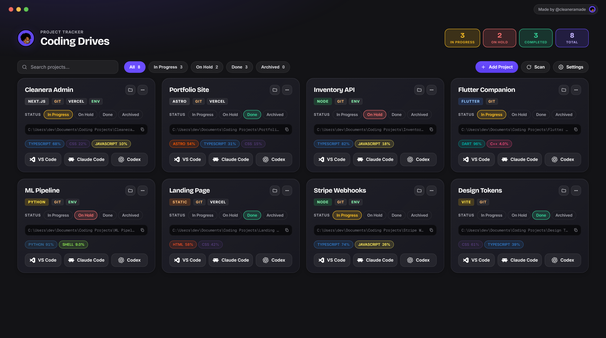

<div align="center">

# Coding Drives

See every coding project on your PC in one dashboard. Open them in VS Code, Claude Code, or Codex, back them up safely, and publish to GitHub — all from one app.

[](LICENSE)  [](#) [](https://www.electronjs.org/)

<br>



</div>

---

## What it does

Point Coding Drives at the folder where you keep your projects. Every subfolder becomes a card.

From any card you can:

- **Open** the project in VS Code, File Explorer, or Claude Code / Codex — terminal *or* desktop app, your choice
- **Back it up** safely to a folder you choose
- **Publish it to GitHub** as a polished public repo — or hand the whole publish to Claude Code / Codex and let it do the work

You can also **add a project in seconds** — name a new one and it's created in your scan folder, or point at an existing folder to connect it — all from a single field.

Everything runs on your computer. No accounts. No telemetry. No cloud sync.

## Features

- **Add or create projects** — name a new one (created in your scan folder) or connect an existing folder, from one smart field
- **Auto-detects each project's stack** — Next.js, React, Node, Python, Rust, Flutter, Go, Astro, Vite, and more
- **Language and tech badges** on every card — language mix, framework, and Git / Vercel / env indicators (toggle on/off in Settings)
- **Status workflow** — In Progress, On Hold, Done, Archived — with live counts, search, and filtering
- **Open anywhere** — VS Code, File Explorer, or Claude Code / Codex in a terminal or their desktop app (toggle in Settings)
- **Safe one-click backups** using Windows' built-in copy engine — overwrite the last backup or keep versioned copies
- **Publish to GitHub** — do it yourself or let Claude/Codex run it — with secrets and `node_modules` excluded, plus tagged releases
- **Custom branding** — drop in your own logo and the window/taskbar icon updates instantly

## Install

**The fast way** — grab the latest installer from the [Releases page](https://github.com/cleaneramade/Coding-Drives/releases) and run it. Per-user install, no admin prompt.

**From source** — requires [Node.js 20+](https://nodejs.org/) and Windows:

```bash
git clone https://github.com/cleaneramade/Coding-Drives.git
cd Coding-Drives
npm install
npm run dev
```

## First launch

The grid will be empty. Open **Settings** (top-right) and:

1. **Scan folders** — add the root folder where your projects live (e.g. `C:\Users\you\Documents\Code`). Every subfolder becomes a card.
2. **Preferences** *(optional)* — toggle language/tech badges, and choose whether the Claude/Codex buttons open a terminal or the desktop app.
3. **Backup destination** *(optional)* — pick where backups should go. Defaults to `Documents\Coding Drives Backups` if you leave it blank.
4. **App logo** *(optional)* — upload your own logo (PNG, ICO, JPG, or SVG) to replace the brand mark.

That's it. Coding Drives rescans whenever the window regains focus, so dropping a new folder into your scan root immediately surfaces it as a card.

## Publishing to GitHub

Click the **⋯** menu on any project card → **Publish to GitHub**.

You only need to set this up once: install the [GitHub CLI](https://cli.github.com/) and run `gh auth login` in a terminal. After that, clicking Publish handles everything — it builds a clean public copy of your project, creates the GitHub repo, generates a README, LICENSE, and issue templates, sets the description and topics, and tags a release.

Prefer to let AI do it? Choose the **AI** option and Claude Code or Codex runs the publish for you. Already published? The same menu becomes **New Release** so you can tag and ship a release in a couple of clicks.

The original folder is never modified. The public copy lands in a sibling folder so you always have a clear separation between your private working copy and what's shipped.

---

## For developers

### Build your own installer

```bash
npm run build
```

The installer ends up at `dist/Coding Drives Setup 1.4.0.exe`.

### Other scripts

- `npm run server` — run only the local server (no app window)
- `npm run icon` — regenerate the app icon from `assets/logo.svg`
- `npm run build:portable` — single-file portable `.exe`
- `npm run build:dir` — unpacked app folder for fast iteration

### How it works

Coding Drives is a small Electron app. The window loads a local web UI served by an in-process Express server. Project state (status, backup history) is stored as JSON under your `%APPDATA%`. The Open actions launch the right tool in the right folder; backups use Windows' `robocopy`; publishing uses the GitHub CLI.

There's no build step for the renderer — `public/index.html`, `public/app.css`, and `public/app.js` are vanilla and load directly.

## License

MIT — see [LICENSE](LICENSE).

---

Made by [@cleaneramade](https://x.com/cleaneramade).
